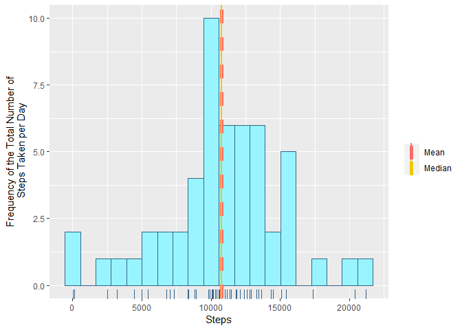
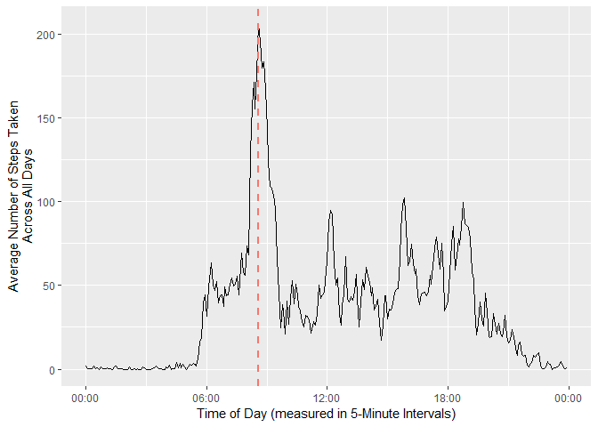
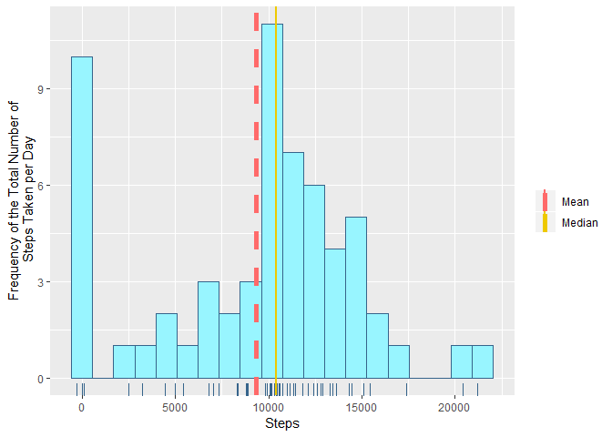

_Introduction_
--------------
It is now possible to collect a large amount of data about personal movement using activity monitoring devices such as a Fitbit, Nike Fuelband, or Jawbone Up. These type of devices are part of the "quantified self" movement -- a group of enthusiasts who take measurements about themselves regularly to improve their health, to find patterns in their behavior, or because they are tech geeks. But these data remain under-utilized both because the raw data are hard to obtain and there is a lack of statistical methods and software for processing and interpreting the data.

This assignment makes use of data from a personal activity monitoring device. This device collects data at 5 minute intervals through out the day. The data consists of two months of data from an anonymous individual collected during the months of October and November, 2012 and include the number of steps taken in 5 minute intervals each day.

_Data Description_
--------------------
The data for this assignment can be downloaded from the course web site:

* **Dataset:** [Activity monitoring data (52K)] [1]

The variables included in this dataset are:

* **steps:** Number of steps taking in a 5-minute interval (missing values are coded as NA)
* **date:** The date on which the measurement was taken in YYYY-MM-DD format
* **interval:** Identifier for the 5-minute interval in which measurement was taken

The dataset is stored in a comma-separated-value (CSV) file and there are a total of 17,568 observations in this dataset.

[1]: https://d396qusza40orc.cloudfront.net/repdata%2Fdata%2Factivity.zip

_Task Description_
------------------
This assignment will be described in multiple parts. You will need to write a report that answers the questions detailed below. Ultimately, you will need to complete the entire assignment in a single R markdown document that can be processed by knitr and be transformed into an HTML file.

Throughout your report make sure you always include the code that you used to generate the output you present. When writing code chunks in the R markdown document, always use echo = TRUE so that someone else will be able to read the code. This assignment will be evaluated via peer assessment so it is essential that your peer evaluators be able to review the code for your analysis.

For the plotting aspects of this assignment, feel free to use any plotting system in R (i.e., base, lattice, ggplot2)

Fork clone the GitHub repository created for this assignment. You will submit this assignment by pushing your completed files into your forked repository on GitHub. The assignment submission will consist of the URL to your GitHub repository and the SHA-1 commit ID for your repository state.

NOTE: The GitHub repository also contains the dataset for the assignment so you do not have to download the data separately.

### _Questions_
**Loading and preprocessing the data.**  
In this section of code, the R packages needed for the analysis will be enabled, previous variables within the workspace will be cleared, previous graphics devices will be cleared and reset to defaults, user-defined variables used to specify working directory and file download location will be defined. 


```r
library("ggplot2")
library("knitr")
```

```
## Warning: package 'knitr' was built under R version 3.5.3
```

```r
library("timeDate")

rm(list = ls())
dev.off()
```

```
## null device 
##           1
```

```r
cwdir <- "C:/Users/mkee1/Documents/Coursera-JH-Data-Science/05_Reproducible_Research/Week 2/RepData_PeerAssessment1/"
filename <- "Raw Data"
dateDownloaded <- date()

fileURL <- "https://d396qusza40orc.cloudfront.net/repdata%2Fdata%2Factivity.zip"
destDL <- "./Activity_Monitoring_Data.zip"
```

This section of code sets the desired work directory using a user-defined function "setdesiredwd". Additionally, this code will also check to see if the file location for the file being downloaded already exists. If it does exist, then it will not recreate the file location and list the files in the desired working directory. If it does not exist, then the file location will automatically be created and, again, list the files in the desired working directory. The code will also download the file of interest, extract the data from the zip file under the desired working directory, and read the file's contents into R.


```r
source("setdesiredwd.R")
setdesiredwd(cwdir)
```

```
## [1] "C:/Users/mkee1/Documents/Coursera-JH-Data-Science/05_Reproducible_Research/Week 2/RepData_PeerAssessment1"
```

```r
if (!file.exists(filename)) {dir.create(filename)}
list.files()
```

```
## [1] "00_Original Files from GitHub Fork"
## [2] "PA1_template_Keed.Rmd"             
## [3] "Raw Data"                          
## [4] "setdesiredwd.R"
```

```r
if (!file.exists("Activity_Monitoring_Data.zip")) 
{
        download.file(fileURL, destfile = destDL)
        print(dateDownloaded)
        unzip("Activity_Monitoring_Data.zip", exdir = "./Raw Data")
}
```

```
## [1] "Tue Mar 26 15:56:42 2019"
```

```r
list.files("Raw Data")
```

```
## [1] "activity.csv"
```

```r
dt0 <- read.csv("./Raw Data/activity.csv", header = TRUE, na.strings = "NA", colClasses = c("integer", "Date", "character"))
str(dt0)
```

```
## 'data.frame':	17568 obs. of  3 variables:
##  $ steps   : int  NA NA NA NA NA NA NA NA NA NA ...
##  $ date    : Date, format: "2012-10-01" "2012-10-01" ...
##  $ interval: chr  "0" "5" "10" "15" ...
```

The following code transforms some of the data in the file. First, the code uses C-style string formating to append leading zero to the hour markers within the "interval" column so that it can be better processed as a R time format. Secondly, the code also merges the "date" & "timeinterval" columns to make a new column mimicking a timestamp. Additionally, the code will check to see if there is date missing from the dataframe (designated as NA), count the missing values if present, and uses the str function to locate columns containing missing values.


```r
dt0$timeinterval <- sprintf("%04d", as.numeric(dt0$interval))
dt0$mergedtime_char <- paste(dt0$date, dt0$timeinterval)
str(dt0)
```

```
## 'data.frame':	17568 obs. of  5 variables:
##  $ steps          : int  NA NA NA NA NA NA NA NA NA NA ...
##  $ date           : Date, format: "2012-10-01" "2012-10-01" ...
##  $ interval       : chr  "0" "5" "10" "15" ...
##  $ timeinterval   : chr  "0000" "0005" "0010" "0015" ...
##  $ mergedtime_char: chr  "2012-10-01 0000" "2012-10-01 0005" "2012-10-01 0010" "2012-10-01 0015" ...
```

```r
chk4NAs <- sum(is.na.data.frame(dt0))
if (chk4NAs == 0) 
{print("There are no missing values")} else 
{sprintf("The number of missing values is: %i", chk4NAs)}
```

```
## [1] "The number of missing values is: 2304"
```

```r
summary(dt0)
```

```
##      steps             date              interval        
##  Min.   :  0.00   Min.   :2012-10-01   Length:17568      
##  1st Qu.:  0.00   1st Qu.:2012-10-16   Class :character  
##  Median :  0.00   Median :2012-10-31   Mode  :character  
##  Mean   : 37.38   Mean   :2012-10-31                     
##  3rd Qu.: 12.00   3rd Qu.:2012-11-15                     
##  Max.   :806.00   Max.   :2012-11-30                     
##  NA's   :2304                                            
##  timeinterval       mergedtime_char   
##  Length:17568       Length:17568      
##  Class :character   Class :character  
##  Mode  :character   Mode  :character  
##                                       
##                                       
##                                       
## 
```

\
**What is mean total number of steps taken per day?**

```r
subdt0_1 <- aggregate(steps ~ date, dt0, sum, na.rm = TRUE) # calculating the total step taken within each day

meanperday <- as.integer(mean(subdt0_1$steps))# Calculation of the mean of the total number of steps taken per day
medianperday <- as.integer(median(subdt0_1$steps))# Calculation of the median of the total number of steps taken per day

# Creating the histogram showing the frequency of steps taken per day
g1 <- ggplot(subdt0_1, aes(steps))
g1+geom_histogram(colour = "steelblue4", fill = "cadetblue1", bins = 20)+geom_rug(colour = "steelblue4", fill = "steelblue4")+geom_vline(mapping = aes(xintercept = meanperday, colour = "Mean"), linetype = "dashed", size = 2, show.legend = TRUE)+geom_vline(mapping = aes(xintercept = medianperday, colour = "Median"), linetype = "solid", size = 1, show.legend = TRUE)+labs(x = "Steps", y = "Frequency of the Total Number of\n Steps Taken per Day")+scale_colour_manual(values = c("indianred1","gold2"), name = "")
```

```
## Warning: Ignoring unknown parameters: fill
```

<!-- -->

The mean of the total number of steps taken per day is approximately 10766 (rounded to the nearest whole number). The median of the total number of steps taken per day is 10765.

\
**What is the average daily activity pattern?**

```r
subdt0_2 <- aggregate(steps ~ timeinterval, dt0, mean, na.rm = TRUE) # calculating the average number of steps taken, averaged across all days

# Creating the time series plot of the 5-minute interval (x-axis) and the average number of steps taken, averaged across all days (y-axis)
g2 <- ggplot(subdt0_2, aes(as.POSIXct(timeinterval, format = "%H%M"),steps))
g2+geom_line()+geom_vline(mapping = aes(xintercept = as.POSIXct(subdt0_2$timeinterval[104], format = "%H%M"), colour = "indianred1"), linetype = "dashed", size = 1, show.legend = FALSE)+labs(x = "Time of Day (measured in 5-Minute Intervals)", y = "Average Number of Steps Taken\nAcross All Days")+scale_x_datetime(date_labels = "%H:%M")
```

<!-- -->

On average across all days, the 5-minute interval that contains the maximum number of steps is 0835 interval.

\
**Imputing missing values.**

```r
dt0$steps_recoded <- dt0$steps # Creating a copy of the original steps column for strategizing how to handle missing values
dt0$steps_recoded[is.na(dt0$steps) == TRUE] <- -1 # Assign all missing values within the dataset as -1

subdt0_3 <- aggregate(steps_recoded ~ date, dt0, sum, na.rm = TRUE) # calculating the total step taken within each day

meanperday2 <- as.integer(mean(subdt0_3$steps_recoded)) # Calculation of the mean of the total number of steps taken per day
medianperday2 <- as.integer(median(subdt0_3$steps_recoded)) # Calculation of the median of the total number of steps taken per day

# Creating the histogram showing the frequency of steps taken per day
g3 <- ggplot(subdt0_3, aes(steps_recoded))
g3+geom_histogram(colour = "steelblue4", fill = "cadetblue1", bins = 20)+geom_rug(colour = "steelblue4", fill = "steelblue4")+geom_vline(mapping = aes(xintercept = meanperday2, colour = "Mean"), linetype = "dashed", size = 2, show.legend = TRUE)+geom_vline(mapping = aes(xintercept = medianperday2, colour = "Median"), linetype = "solid", size = 1, show.legend = TRUE)+labs(x = "Steps", y = "Frequency of the Total Number of\n Steps Taken per Day")+scale_colour_manual(values = c("indianred1","gold2"), name = "")
```

```
## Warning: Ignoring unknown parameters: fill
```

<!-- -->

This section of code deals with imputting missing values. The strategy that I decided to use was to replace all of the missing values (designated by NA) with -1s. Because the dataset already contain measurements recorded as zero, I did not want to mix the missing values with the zero values. Therefore, I decide to make the missing values more distinguishable from the rest of the dataset. By me doing this, the mean values shifted more to the left of its orignial value when compared to the previous, therefore indicating a decrease in the mean value. The median value also showed a small shift to the left, hence also showing a decreae in value. However, the shift as observed with the median was not nearly as large as the shift observed in the mean value. The values of the newly calculated mean and median are 9316 and 10395 respectively.

\
**Are there difference in activity patterns between weekdays and weekends?**

```r
# Creating a new column designating the day of the week as derived from the column containing a timestamp (mergedtime_char) & converting the result to a colunmn of factors
dt0$dayofwk <- factor(weekdays(strptime(dt0$mergedtime_char, format = "%Y-%m-%d %H%M")), levels = c("Monday", "Tuesday", "Wednesday", "Thursday", "Friday", "Saturday", "Sunday"))

# Creating a new column designating the whether or not the day of the week as derived from the column containing a timestamp (mergedtime_char) is considered to be a weekday or a part of the weekend & converting the result to a colunmn of factors
dt0$WkdyOrNah <- factor(isWeekday(strptime(dt0$mergedtime_char, format = "%Y-%m-%d %H%M")), levels = c("FALSE", "TRUE"), labels = c("Weekend","Weekday"))

subdt0_4 <- aggregate(steps ~ timeinterval+WkdyOrNah, dt0, mean, na.rm = TRUE) # calculating the average number of steps taken, averaged across all days

# Creating the time series plot of the 5-minute interval (x-axis) and the average number of steps taken, averaged across all days (y-axis) by weekday-weekend factor classificaions
g4 <- ggplot(subdt0_4, aes(as.POSIXct(timeinterval, format = "%H%M"),steps))
g4+geom_line()+facet_grid(WkdyOrNah~.)+labs(x = "Time of Day (measured in 5-Minute Intervals)", y = "Average Number of Steps Taken\nAcross All Days")+scale_x_datetime(date_labels = "%H:%M")
```

<!-- -->

According to the graph presented below, there does seem to be a difference in the activity pattern between weekdays and weekends.

\
The End - KP23
